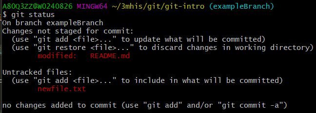

## Making Changes With Git

After you have [cloned the repo](README.md), you can start making changes to the code in the repository. Follow the steps below to make changes.

### Creating a Branch

Before you start working on a new feature or project update, you'll want to create a new branch. Run the following command to create a branch.:

```bash
git checkout -b yourBranchName
```

### Update Files

Now that you have a branch, create or update some files inside your repository.

If you run `git status` you should see that git knows about your changes:



To officially save our changes, we'll want to 'add' and 'commit' our files.

### Adding and Commiting Changes

In order to commit your changes in git, you'll first have to decide which files to add to the commit.

Use `git add` to include your files in what will be committed:

```bash
git add filename1
git add filename2
```

Once your files are committed, another `git status` should show that they are ready to commit.


Now you can commit your files:

```bash
git commit -m "I created/modified some files!"
```

Your commit is now added to the commit history - the history of all changes to your project. This new commit is currently only available on your local computer. Let's share your changes with your team.

### Pushing Changes

Use the command `git push` to upload your commits to the repository stored on github. Then your teammates can see your changes and checkout your branch to add their own changes.

If you just created a new branch you'll probably see a message like this:


Technically your local branch needs to know the name of the branch to upload to on 'origin' (the remote GitHub repo)

Use the command in the message from git to push and set the name of your upstream branch:

```bash
git push --set-upstream origin exampleBranch
```

Next Step: [Creating a Pull Request](CreatingAPullRequest.md)

[Back To Repo Home](https://github.com/pclarke2mmm/git-intro)
